# Documentación Swagger de las APIs

Capturas del Swagger UI de cada microservicio, con cada endpoint expandido mostrando sus parámetros, request body de ejemplo y códigos de respuesta.

Las imágenes están en [`docs/swagger/`](swagger/) y siguen la convención de nombre `<servicio>-<verbo>-<accion>.png`.

| Servicio | Puerto local | Swagger |
|---|---|---|
| Users.API | 5029 | http://localhost:5029/swagger |
| Products.API | 5290 | http://localhost:5290/swagger |
| Cart.API | 5277 | http://localhost:5277/swagger |
| Orders.API | 5074 | http://localhost:5074/swagger |
| Notifications.API | 5026 | http://localhost:5026/swagger |

---

## Users.API

### POST /api/users/register

Registra un usuario nuevo. Devuelve `201 Created` con el usuario creado, `400 Bad Request` si el body es inválido y `409 Conflict` si el email ya existe.

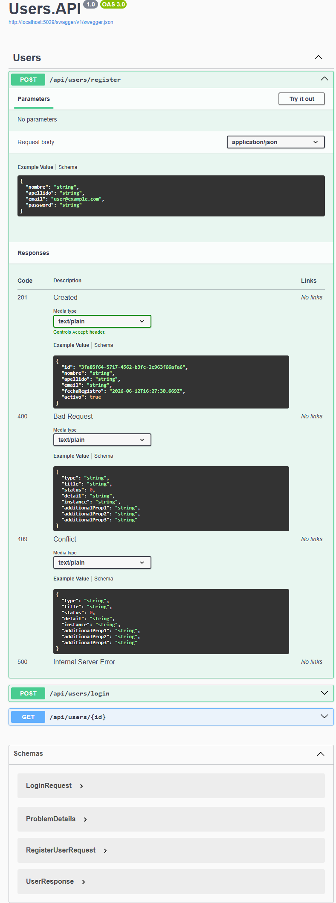

### POST /api/users/login

Login con email y password. Devuelve `200 OK` con los datos del usuario, `401 Unauthorized` si las credenciales son incorrectas y `403 Forbidden` si el usuario está inactivo.

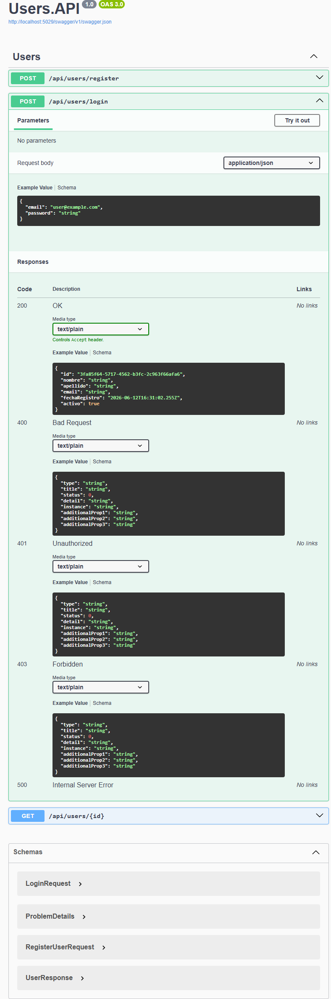

### GET /api/users/{id}

Obtiene un usuario por su id. Devuelve `200 OK` o `404 Not Found` si no existe.

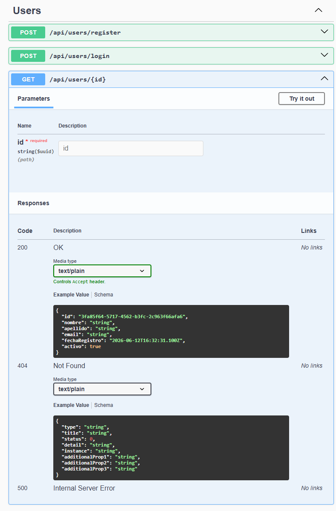

---

## Products.API

### GET /api/products

Lista todos los productos. Acepta filtros opcionales por `categoria` y `nombre` (substring case-insensitive). Ejemplo: `GET /api/products?categoria=Electronica&nombre=Dell`.

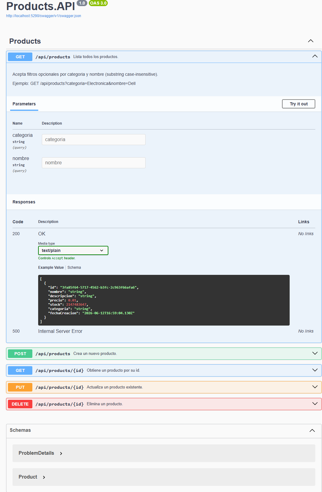

### POST /api/products

Crea un nuevo producto. Devuelve `201 Created`, `400 Bad Request` si el body es inválido y `409 Conflict` (PRD-003) si ya existe un producto con el mismo nombre en la categoría.

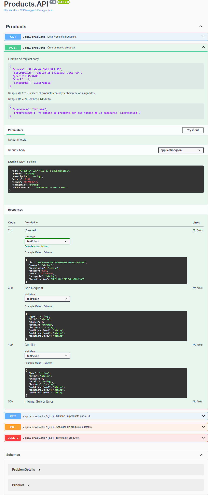

### GET /api/products/{id}

Obtiene un producto por su id. Devuelve `200 OK` o `404 Not Found` (PRD-001) si no existe.

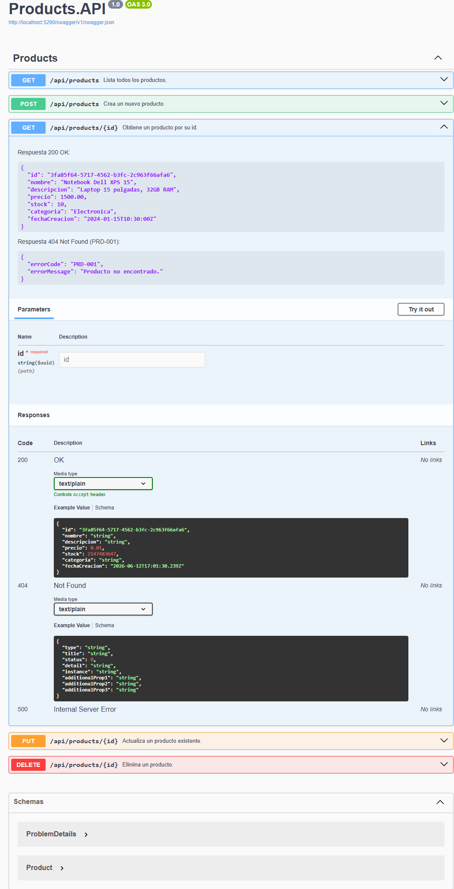

### PUT /api/products/{id}

Actualiza un producto existente. Si cambia el precio o el stock, notifica vía Notifications.API a los usuarios que tienen el producto en su carrito (consultando Cart.API).

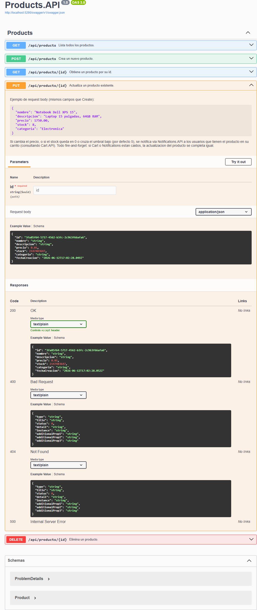

### DELETE /api/products/{id}

Elimina un producto. Devuelve `204 No Content` si existía, `404 Not Found` (PRD-001) si no existe y `409 Conflict` (PRD-004) si el producto tiene órdenes activas.

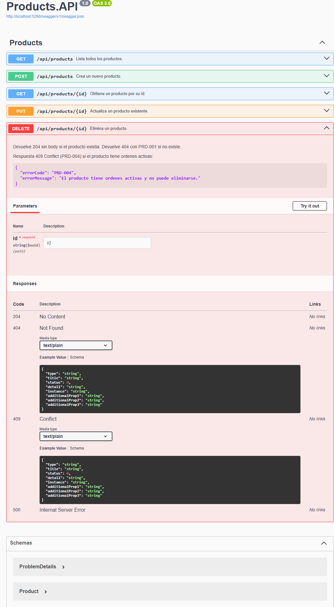

---

## Cart.API

### GET /api/cart/{userId}

Obtiene el carrito de un usuario. Devuelve `200 OK` con el carrito y sus items, o `404 Not Found` (CRT-001) si el usuario no tiene carrito activo.

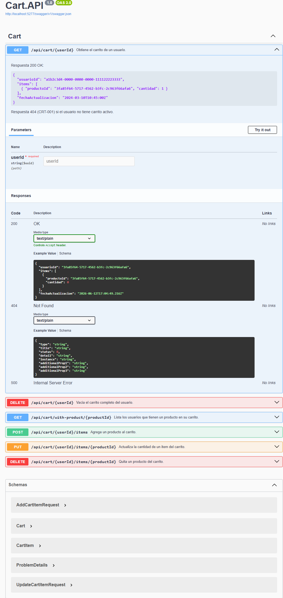

### DELETE /api/cart/{userId}

Vacía el carrito completo del usuario. Devuelve `204 No Content` sin body, o `404 Not Found` (CRT-001) si el carrito no existe.

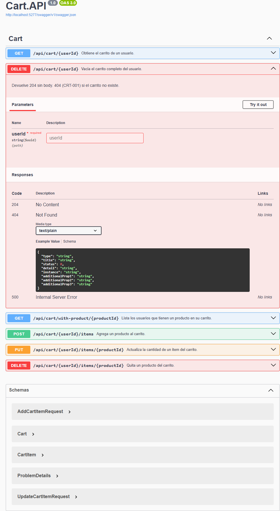

### GET /api/cart/with-product/{productId}

Lista los usuarios que tienen un producto en su carrito. Lo usa Products.API para avisar cambios de precio o stock a quienes tienen el producto agregado. Devuelve `200 OK` con una lista de `userId` (vacía si nadie lo tiene).

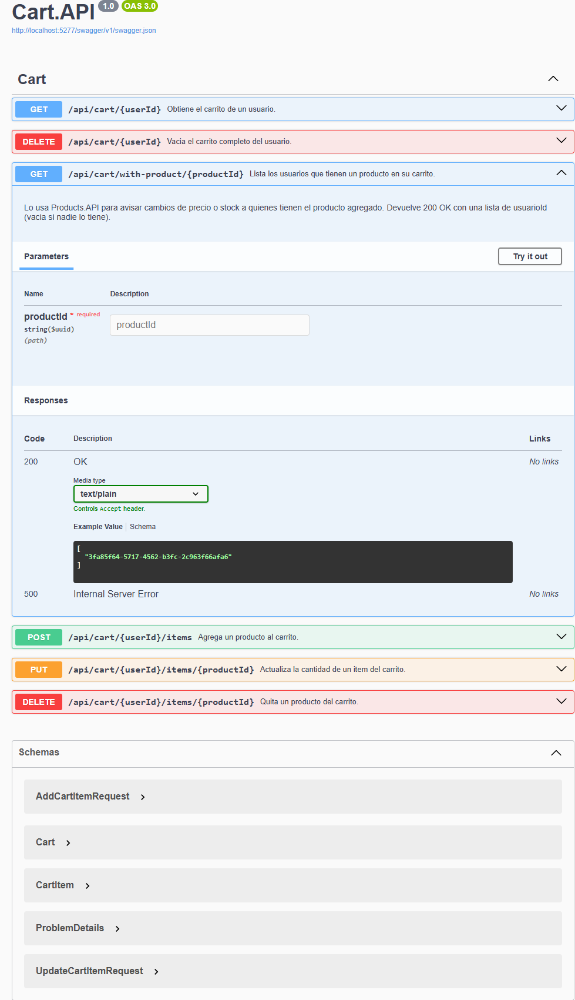

### POST /api/cart/{userId}/items

Agrega un producto al carrito. Valida el producto contra Products.API: `404` (CRT-002) si no existe y `409` (CRT-003) si no hay stock suficiente. Al agregarse el item se envía una notificación al usuario a través de Notifications.API.

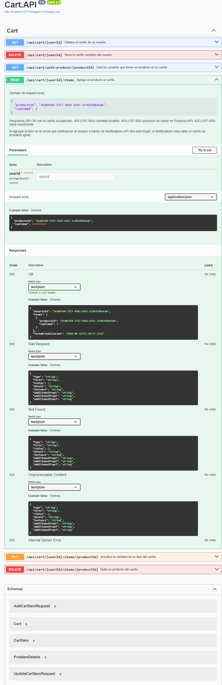

### PUT /api/cart/{userId}/items/{productId}

Actualiza la cantidad de un item del carrito. Devuelve `200 OK` con el carrito actualizado, `400` si la cantidad es inválida, `404` (CRT-001) si el carrito o el item no existen y `422` (CRT-003) si no hay stock.

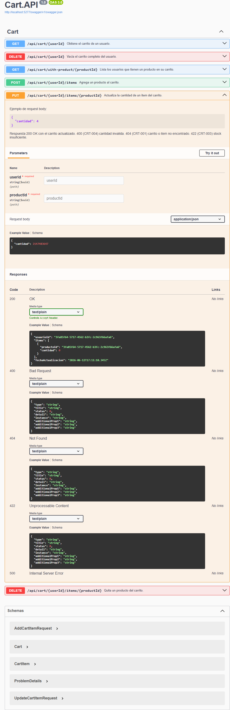

### DELETE /api/cart/{userId}/items/{productId}

Quita un producto del carrito. Devuelve `204 No Content` sin body, o `404 Not Found` (CRT-001) si no existe.

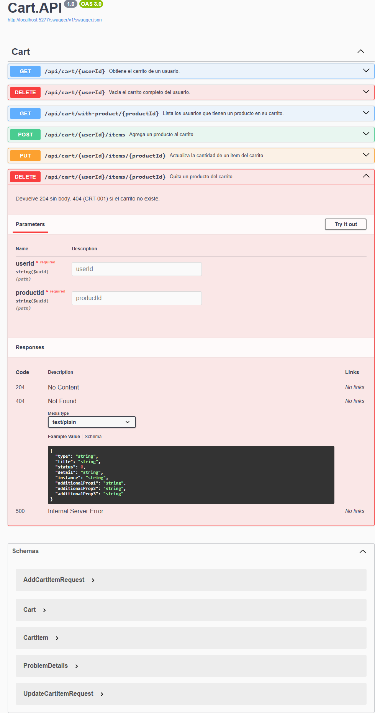

---

## Orders.API

### GET /api/orders

Devuelve todas las órdenes. Permite filtrar por usuario con el query param `usuarioId`.

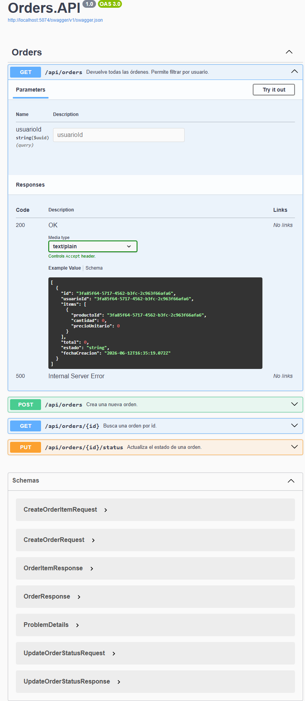

### POST /api/orders

Crea una nueva orden. Devuelve `201 Created` con la orden, `400 Bad Request` si el body es inválido y `422 Unprocessable Content` si algún producto no es válido.

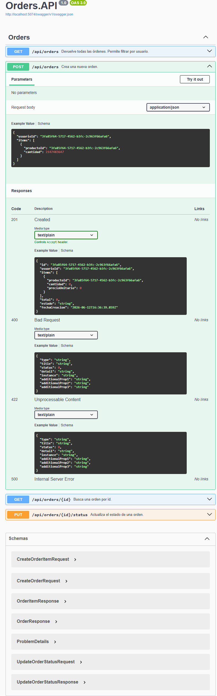

### GET /api/orders/{id}

Busca una orden por id. Devuelve `200 OK` o `404 Not Found` si no existe.

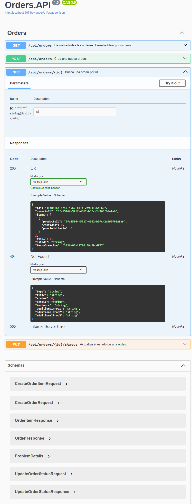

### PUT /api/orders/{id}/status

Actualiza el estado de una orden. Devuelve `200 OK` con el nuevo estado, `404 Not Found` si la orden no existe y `409 Conflict` si la transición de estado no es válida.

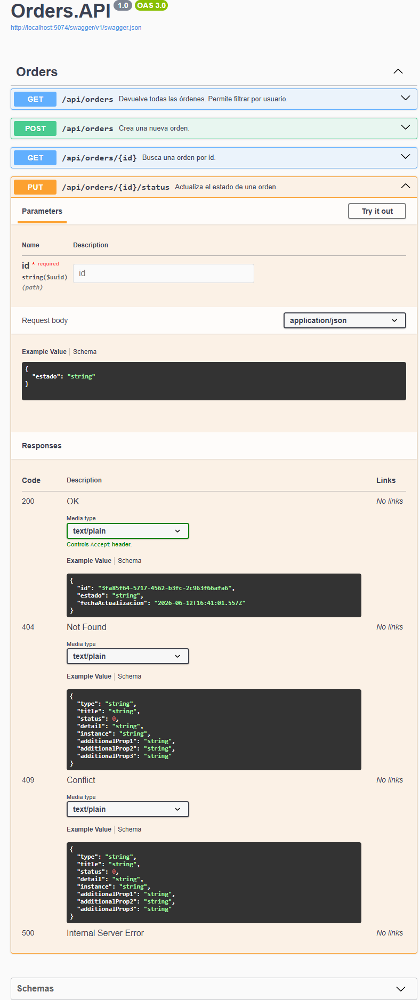

---

## Notifications.API

### POST /api/notifications/send

Registra y simula el envío de una notificación. Devuelve `201 Created` con la notificación, `400 Bad Request` si el body es inválido y `404 Not Found` si el usuario no existe.

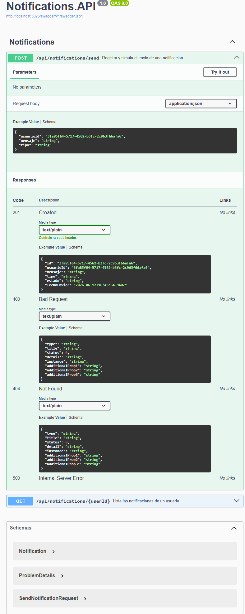

### GET /api/notifications/{userId}

Lista las notificaciones de un usuario. Devuelve `200 OK` con la lista o `404 Not Found` si el usuario no existe.

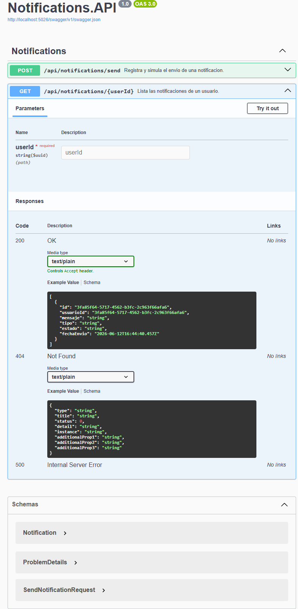
